<p align="center">
  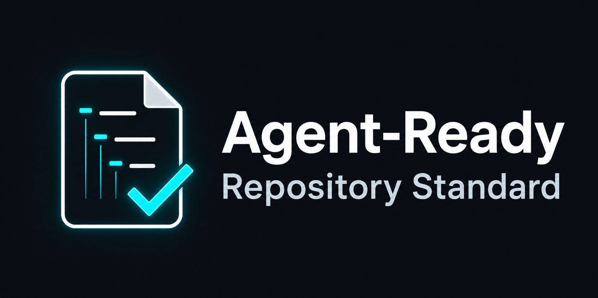
</p>

<p align="center">
  
  
  
  
  
</p>

<p align="center">
  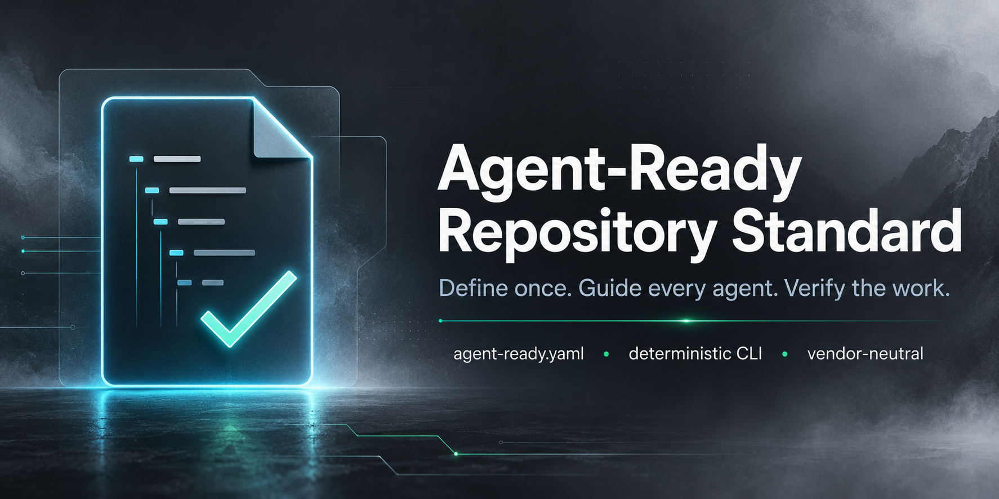
</p>

# 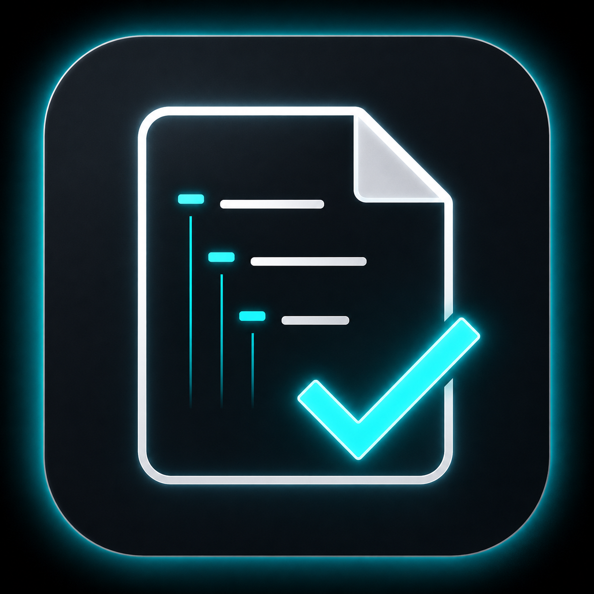 Agent-Ready

**The missing contract between repositories and coding agents.**

Agent-Ready is an open, vendor-neutral specification and deterministic CLI
for describing how AI coding agents should work inside a software repository.
Like `package.json` for packages, `agent-ready.yaml` is the single,
schema-validated source of truth for a repository's commands, environment,
instructions, restrictions, verification requirements, and completion evidence.

**Define once. Guide every agent. Verify the work.**

No API keys. No LLM calls. No network access. Zero cost per run.

<p align="center">
  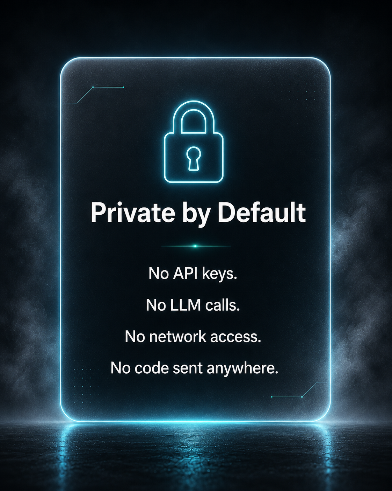
</p>

## Why Agent-Ready Exists

AI coding agents are becoming part of everyday software development, but most
repositories still don't have a standard way to explain how agents should work.

Instructions are scattered across README files, contributor docs,
tool-specific rule files, hidden prompts, and repeated chat messages.
Agents guess which commands to run. Maintainers repeat themselves.
Verification is inconsistent. There's no proof work was actually done.

Agent-Ready fixes this with one structured contract.

<p align="center">
  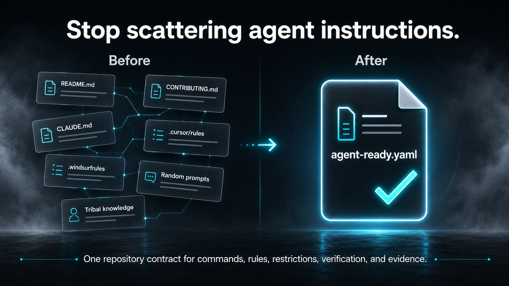
</p>

## The Repository Contract

At the center of an Agent-Ready repository is one file:

```
agent-ready.yaml
```

This file defines how agents should work inside the project. It carries:

- **Project metadata** — name, description
- **Environment** — runtime versions, package manager
- **Commands** — lint, test, build, typecheck, and custom commands
- **Verification** — ordered pipeline of commands that must pass before work is complete
- **Paths** — protected files (never modify), generated files (never hand-edit), ignored paths
- **Instructions** — hand-authored Markdown content and links to documentation
- **Architecture** — ordered boundaries, invariants, and durable decision links
- **Agent guidance** — actions to avoid, approval points, and essential context files
- **Adapters** — which agent instruction files to generate (AGENTS.md, CLAUDE.md, .cursorrules, Copilot, Gemini)

<p align="center">
  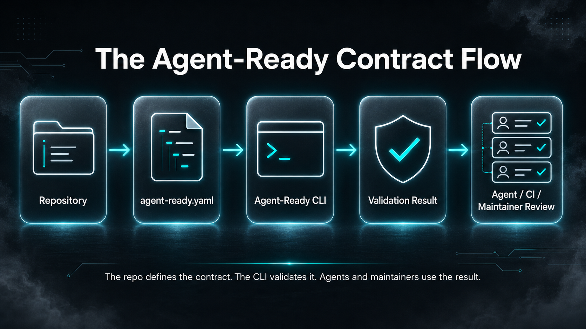
</p>

### A concrete example

```yaml
version: 1

project:
  name: my-project
  description: A well-defined Agent-Ready repository.

environment:
  runtimes:
    node: ">=20 <23"
  packageManager:
    name: pnpm
    version: "10"

commands:
  lint:
    run: pnpm lint
  typecheck:
    run: pnpm typecheck
  test:
    run: pnpm test
  build:
    run: pnpm build
    description: Compiles the project into dist/.

verification:
  required:
    - lint
    - typecheck
    - test
    - build

paths:
  protected:
    - ".env*"
  generated:
    - "dist/**"
  ignored:
    - "node_modules/**"

instructions:
  content: |
    ## Conventions

    - Use `const` over `let` wherever possible.
    - Prefer explicit return types on exported functions.

    ## Architecture

    This project follows a modular structure. Each feature lives in
    its own directory under `src/` with its own tests and types.

  sources:
    - README.md
    - docs/architecture.md

architecture:
  boundaries:
    - Features must not import each other directly.
  invariants:
    - Shared utilities remain dependency-light.
  key_decisions:
    - file: docs/decisions/0001-modular-features.md
      summary: Features communicate through the shared layer.

agents:
  disallowed_actions:
    - Install packages without explicit approval.
  approval_required_for:
    - Changes to CI configuration.
  context_files:
    - docs/architecture.md

adapters:
  agentsMd:
    enabled: true
  claude:
    enabled: true
  cursor:
    enabled: true
  copilot:
    enabled: true
  gemini:
    enabled: true
```

<p align="center">
  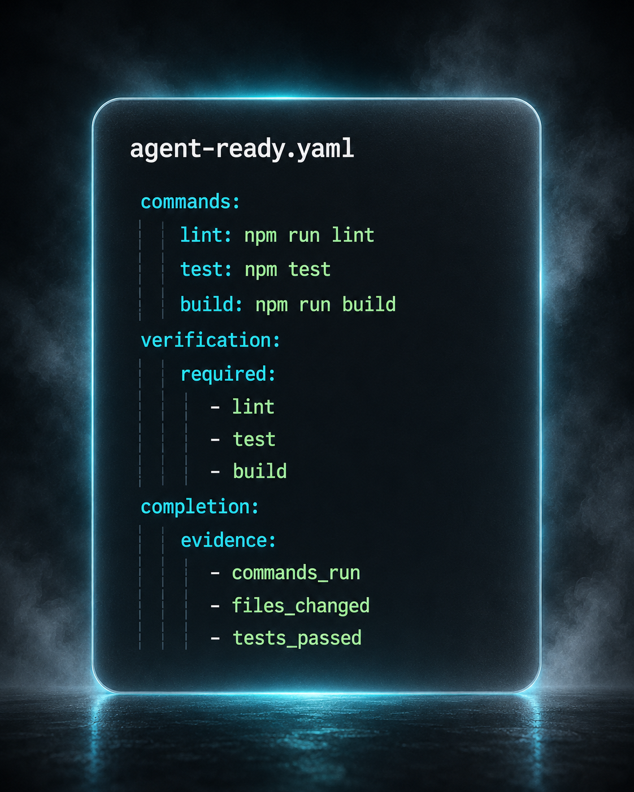
</p>

## Deterministic by Design

Agent-Ready validation does not depend on an AI model. The CLI validates
`agent-ready.yaml` locally against a strict JSON Schema. It never calls an
LLM, never requires API keys, never sends code to a server, and never needs
network access. The same contract produces the same result every time.

<p align="center">
  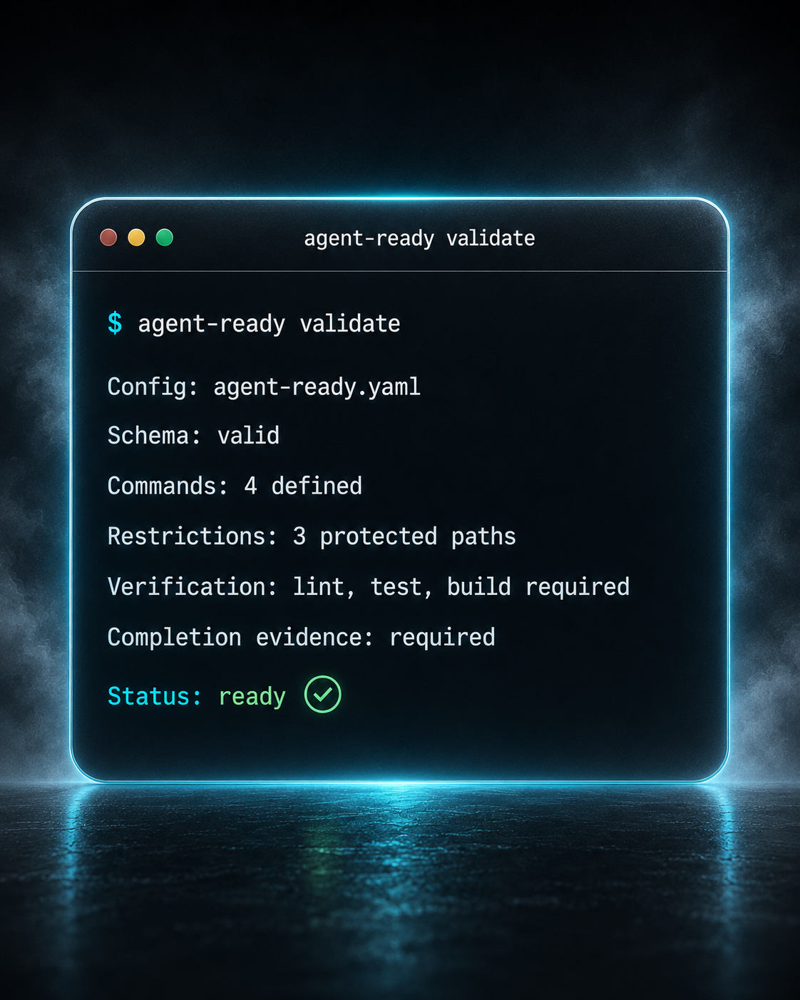
</p>

The CLI ships **eleven real commands** — not documentation placeholders:

| Command    | What it does                                                                       |
| ---------- | ---------------------------------------------------------------------------------- |
| `validate` | Discover, parse, and validate the contract                                         |
| `inspect`  | Print the fully normalized contract                                                |
| `generate` | Generate AGENTS.md, CLAUDE.md, .cursorrules, Copilot, and Gemini instruction files |
| `check`    | Enforce protected paths against real Git changes                                   |
| `analyze`  | Check instruction links plus declared architecture and agent-context files         |
| `schema`   | Print the bundled contract JSON Schema                                             |
| `doctor`   | Inspect the host environment against contract requirements                         |
| `explain`  | Print extended plain-language explanations of diagnostic codes                     |
| `init`     | Scaffold a starter `agent-ready.yaml` from repository inspection                   |
| `upgrade`  | Propose or apply safe, additive modernizations to an existing contract             |
| `verify`   | Execute the contract's verification pipeline and record evidence                   |

Every command supports `--json` for CI and tooling. See the
[CLI reference](docs/specification/cli-reference.md) for flags, exit codes,
and output shapes.

## What "Done" Should Mean

Agent-Ready's verification pipeline runs the contract's declared commands in
order and records pass/fail/timeout evidence for each. With `--record`, it
writes a JSON evidence file to the repo root — durable proof of what was
verified and what happened. No more vague "done."

<p align="center">
  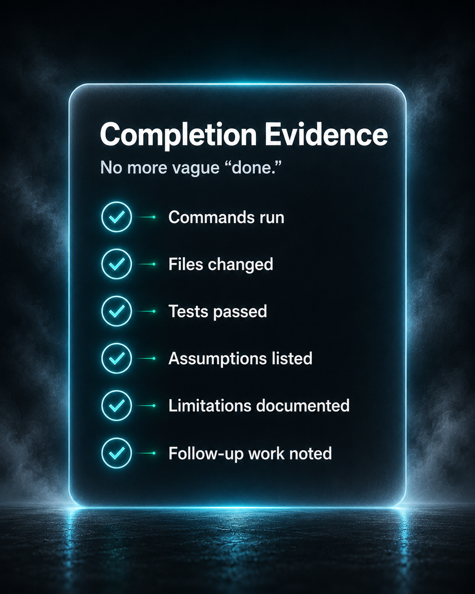
</p>

## Vendor-Neutral

Agent-Ready belongs to the repository, not the agent vendor. It generates
instruction files for all major coding agents from one contract:

**AGENTS.md** · **CLAUDE.md** · **.cursorrules** · **Copilot instructions** · **Gemini instructions**

One repository contract. Any agent. Write the instructions once.

<p align="center">
  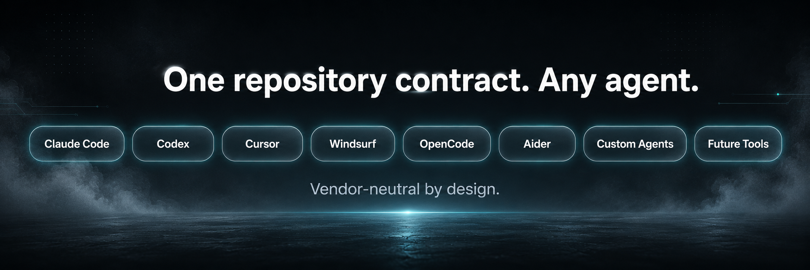
</p>

## Installation

The stable package is available under npm's `latest` tag. Install it with:

```bash
npm install --save-dev @adameddahmouni/agent-ready
# or
pnpm add --save-dev @adameddahmouni/agent-ready
```

Then run the local binary with `npx agent-ready` or `pnpm exec agent-ready`.
Agent-Ready requires Node.js `>=20.0.0`.

### Development Setup

To work on Agent-Ready itself:

```bash
git clone https://github.com/AdamEddahmouni/agent-ready.git
cd agent-ready
corepack enable   # enables pnpm
pnpm install
pnpm build
```

## Quick start

The commands below assume the npm package is installed. From a source checkout,
replace `agent-ready` with `pnpm cli --`.

```bash
# Scaffold a starter contract from your repo
agent-ready init

# Review it, then write it
agent-ready init --write

# Validate the contract
agent-ready validate

# Check your environment
agent-ready doctor

# Generate agent instruction files
agent-ready generate --write

# Run verification
agent-ready verify --execute
```

## Specification Goals

**Repository-Owned** — Agent instructions live in the repository, not in
private chats, hidden prompts, or vendor-specific config files.

**Vendor-Neutral** — The standard describes a repository contract without
depending on a specific model, editor, agent, or provider.

**Deterministic** — Validation is repeatable and never requires LLM calls,
API keys, network access, or paid services.

**Human-Reviewable** — Rules are readable by maintainers, contributors,
and reviewers.

**Agent-Usable** — Instructions are structured enough for coding agents
to consume reliably.

**Verification-First** — Agents should not claim completion without
reporting what they ran, what passed, and what changed.

## Project Status

Agent-Ready is **pre-1.0**. The current stable release is `0.5.0`. The core contract schema and
CLI are stable enough for evaluation and daily use. Path A (the adoption
funnel: `schema` →
`doctor` → `explain` → `init`) is complete. All eleven commands ship and run
today, including the v0.4 `upgrade` command and v0.5 architecture and agent-guidance blocks.

CI runs 512 automated tests across 39 test files, exercising the full pipeline
on Ubuntu, Windows, and macOS. Release tags are cut only from a green quality
gate.

<p align="center">
  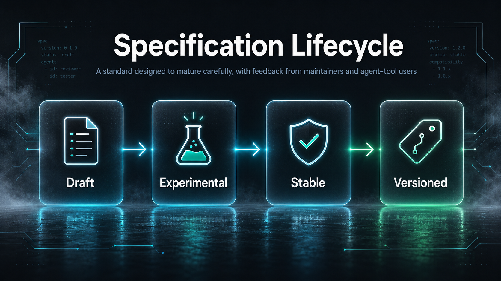
</p>

## CI Integration

Adopt the same commands in another repository's CI via the reusable GitHub
composite action. The example below targets the current stable tag:

```yaml
- uses: actions/checkout@v4
- uses: AdamEddahmouni/agent-ready@v0.5.0
  with:
    command: verify
    execute: "true"
```

<p align="center">
  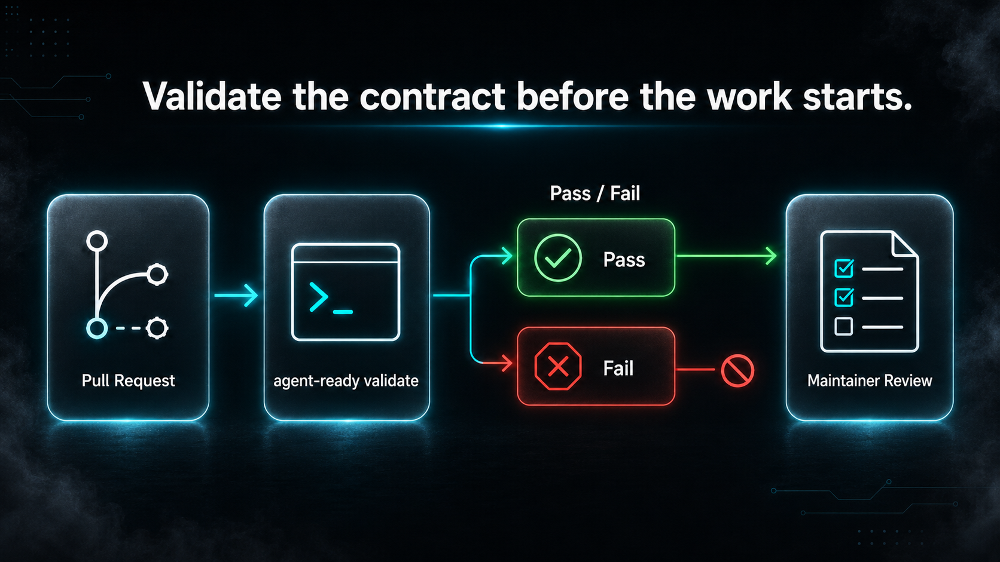
</p>

See [docs/specification/ci-integration.md](docs/specification/ci-integration.md)
for the full reference.

## Documentation

- [Specification overview](docs/specification/overview.md)
- [Contract reference](docs/specification/contract-reference.md)
- [CLI reference](docs/specification/cli-reference.md)
- [Diagnostic codes](docs/specification/diagnostics.md)
- [CI integration](docs/specification/ci-integration.md)
- [Path and glob semantics](docs/specification/paths-and-globs.md)
- [Architecture overview](docs/architecture/overview.md)
- [Architecture Decision Records](docs/decisions/README.md)
- [Project standing](docs/project-standing.md)
- [Roadmap](ROADMAP.md) — completed phase history and current non-goals
- [Roadmap to 1.0](ROADMAP-TO-1.0.md) — forward release plan from v0.5.0 to v1.0.0
- [Adoption guide](docs/adoption-guide.md)
- [Threat model](docs/security/threat-model.md)

## Dogfooding

Agent-Ready validates itself. This repository's own
[`agent-ready.yaml`](agent-ready.yaml) passes `agent-ready validate`,
and the same CLI commands described above run in CI against this
repository's own contract on every push and pull request. If you want to
see what a fully configured Agent-Ready repository looks like, you're
looking at one.

## Contributing

See [CONTRIBUTING.md](CONTRIBUTING.md). Security issues should be
reported per [SECURITY.md](SECURITY.md).

## License

Apache License 2.0 — see [LICENSE](LICENSE).
